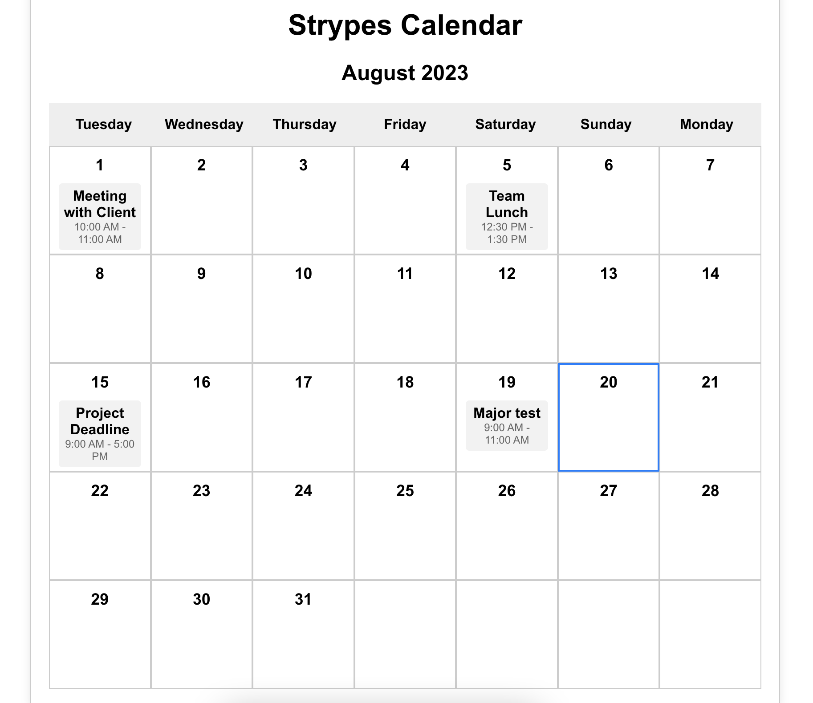

# Simple calendar!
It's just a simple calendar, in which, you can add events from .json file (hardcoded atm.). The calendar it's following the current year/mounth/date using the js Date() functions and for the events we follow the YY-MM-DD standard. Also the events have a little pop-up window when you click on them for some description information. The calendar also highlighting you the current day.

## Tech
1. React
2. Redux

# Demo: 
https://enermax5555.github.io/StrypesCalendar/